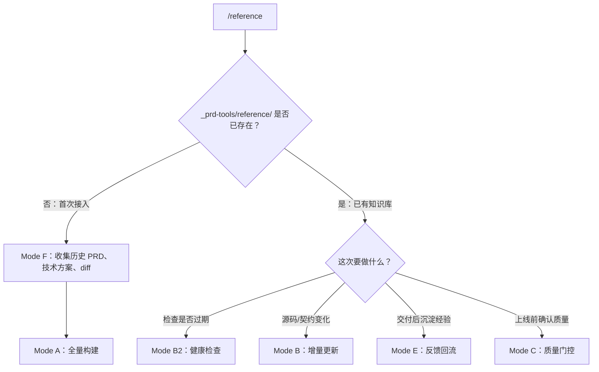
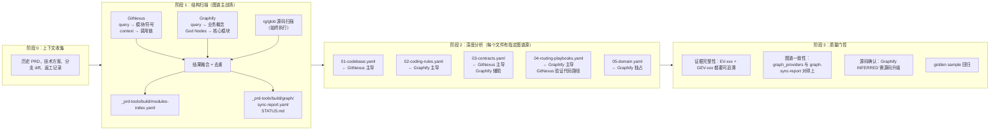

# build-reference

> 构建项目知识库 `_prd-tools/reference/`，把源码结构、业务术语、跨层契约、开发套路沉淀为 PRD-to-code 可复用的长期记忆。

## 快速使用

在 Claude Code 中进入目标项目，运行：

```
/reference
```

首次使用会自动引导：收集历史 PRD → 全量构建。之后每次跑增量更新、健康检查或反馈回流即可。

## 三层图谱架构

build-reference 不只是扫描源码，而是融合三个维度构建知识库：

```
Graphify（业务维度）        GitNexus（代码维度）        prd-tools（治理维度）
"为什么这样设计"             "代码怎么连接"              "怎么从 PRD 到代码"
PRD/技术方案/截图/历史文档    代码仓库                   编排 + 证据治理 + 质量门控
        │                         │                           │
        └─────────────────────────┼───────────────────────────┘
                                  ▼
                        _prd-tools/reference/ 单仓可治理知识库
```

关键原则：**图谱是原始发现层，reference 是精选后的企业知识库。** 图谱发现仍需源码确认。

## 流程总览

### 模式选择



### Mode A 全量构建的内部过程（图谱如何参与）

这是最核心的模式，分 4 个阶段，每阶段都有图谱参与：



### 图谱工具在各阶段的具体查询

**阶段 1 结构扫描：**

| 工具 | 查询 | 获取什么 | 回退方案 |
|------|------|---------|---------|
| GitNexus | `query` | 所有模块和符号 | rg/glob 扫描 |
| GitNexus | `context` | 每个模块的调用者和被调用者 | import 分析 |
| Graphify | `/graphify query` | 业务概念、核心模块职责 | 逐文件 Read |
| Graphify | God Nodes | 跨域依赖、Surprising Connections | 手动推断 |

**阶段 2 深度分析 — 每个 reference 文件的数据来源：**

| reference 文件 | 主图谱源 | 辅助图谱源 | 具体获取什么 |
|---|---|---|---|
| `01-codebase.yaml` | GitNexus | — | 模块列表、符号定义、数据流、入口点 |
| `02-coding-rules.yaml` | Graphify | — | 设计原理（rationale_for）、高风险区域、踩坑经验 |
| `03-contracts.yaml` | GitNexus | Graphify | API consumer/producer、调用链、字段级定义 |
| `04-routing-playbooks.yaml` | Graphify | GitNexus | 业务聚类（Leiden）→ 路由信号；GitNexus 验证代码路径存在 |
| `05-domain.yaml` | Graphify | — | 术语、隐式规则、历史决策、业务约束 |

**阶段 3 质量门控 — 图谱证据校验：**

| 检查项 | 规则 |
|--------|------|
| 图谱证据可追溯 | 所有 `GEV-xxx` / `GEV-Bxxx` 必须在 `_prd-tools/build/graph/` 中有对应条目 |
| 图谱-源码一致性 | `project-profile.yaml` 的 `graph_providers` 与 `graph-sync-report` 匹配 |
| 置信度分级 | GitNexus AST high 不需确认；Graphify INFERRED medium/low 需源码升级 |
| 样例回归 | 至少 1 个 golden sample 反推 PRD → IR → Impact → Contract 走通 |

### 证据双轨制

每个 reference 条目使用两套独立证据，**不能互相替代**：

```
evidence: ["EV-001"]                    ← 可审计证据（源码、文档、人工确认）
graph_evidence_refs: ["GEV-001"]        ← 代码图谱溯源（GitNexus 结构发现）
graph_evidence_refs: ["GEV-B001"]       ← 业务图谱溯源（Graphify 业务发现）
```

- GitNexus AST 提取（high confidence）→ 不需要额外源码确认
- Graphify EXTRACTED + source locator（high）→ 不需要额外确认
- Graphify INFERRED（medium/low）→ 必须用源码确认后才能写入 reference

## 什么时候用

| 场景 | 用什么 |
|------|--------|
| 团队第一次接入 PRD Tools | Mode F → Mode A |
| 项目结构、接口或业务规则大改 | Mode B 或 Mode A |
| PRD 交付后想沉淀经验 | Mode E |
| 怀疑知识库过期或有幻觉 | Mode B2 → Mode C |
| 上线前做质量确认 | Mode C |

**不适合的场景：** 只是解释代码、直接改代码、没有源码也没有上下文。

## 工作模式

| 模式 | 说明 | 输出 |
|------|------|------|
| **F 上下文收集** | 收集历史 PRD、技术方案、分支 diff | `_prd-tools/build/context-enrichment.yaml` |
| **A 全量构建** | 首次或重建整个知识库 | `_prd-tools/reference/` 全部文件 |
| **B 增量更新** | 只更新受 git diff 影响的部分 | 更新后的 `_prd-tools/reference/` |
| **B2 健康检查** | 检查是否过期、缺证据、边界混乱 | `_prd-tools/build/health-check.yaml` |
| **C 质量门控** | 检查证据、契约闭环、幻觉风险 | `_prd-tools/build/quality-report.yaml` |
| **E 反馈回流** | 从 prd-distill 输出回收新知识 | `_prd-tools/build/feedback-report.yaml` |

## 产出文件

### 长期知识库 `_prd-tools/reference/`

```
_prd-tools/reference/
├── 00-portal.md                # 人类导航 + 场景阅读指南
├── project-profile.yaml        # 项目画像：技术栈、入口、能力面
├── 01-codebase.yaml            # 代码库清单：目录、枚举、模块、注册点
├── 02-coding-rules.yaml        # 编码规则：规范 + 踩坑经验
├── 03-contracts.yaml           # 跨层契约：endpoint、schema、字段定义
├── 04-routing-playbooks.yaml   # PRD 路由信号 + 场景打法 + QA 矩阵
└── 05-domain.yaml              # 业务领域：术语、背景、隐式规则
```

### 过程报告 `_prd-tools/build/`

```
_prd-tools/build/
├── context-enrichment.yaml         # 历史样例和 golden sample 候选
├── modules-index.yaml              # 项目扫描快照
├── health-check.yaml               # 健康检查结果
├── quality-report.yaml             # 质量门控结果
├── feedback-report.yaml            # 反馈回流审计
└── graph/
    ├── sync-report.yaml            # 图谱可用状态（始终生成）
    ├── STATUS.md                   # 给人看的图谱状态
    ├── code-evidence.yaml          # GitNexus 证据
    └── business-evidence.yaml      # Graphify 证据
```

## 外部工具如何参与

build-reference 可以利用两个外部图谱工具加速构建。**两个都是可选的**——没有它们也能正常工作（回退到源码扫描）。

| 工具 | 维度 | 它做什么 | 没有它会怎样 |
|------|------|---------|-------------|
| **[GitNexus](https://github.com/abhigyanpatwari/GitNexus)** | 代码结构 | AST 解析 → 模块、符号、调用链、API consumer、执行流追踪 | 用 `rg`/glob + Read 手动扫描源码 |
| **[Graphify](https://github.com/safishamsi/graphify)** | 业务语义 | 从代码/文档中提取业务概念聚类、设计原理、隐式关联 | 手工阅读代码和文档推断业务语义 |

GitNexus 提供 `01-codebase` 和 `03-contracts` 的结构证据；Graphify 提供 `02-coding-rules`、`04-routing-playbooks` 和 `05-domain` 的业务语义证据。

安装脚本会自动索引。后续可手动更新：
```bash
# GitNexus：更新代码结构索引（含语义搜索）
gitnexus analyze . --embeddings

# Graphify：更新代码结构（快速，无 LLM）
graphify update .

# Graphify：深度业务语义图谱（需要 LLM Vision API Key）
# 在 Claude Code 中运行 /graphify . --mode deep
```

## 典型落地路径

**首次接入：**
1. 准备 1-3 个历史 PRD、技术方案和对应分支 diff
2. 运行 `/reference` → Mode F（收集上下文）→ Mode A（全量构建）
3. 运行 Mode B2（健康检查）+ Mode C（质量门控）

**日常使用：**
1. 代码或契约变化后运行 Mode B（增量更新）
2. PRD 交付完成后运行 Mode E（反馈回流）
3. 定期运行 Mode B2 检查知识库是否过期

## 常见问题

**Q: `_prd-tools/reference/` 要提交到 git 吗？**
A: 建议 `.gitignore` 排除。`_prd-tools/reference/` 是本地生成的知识库，每个开发者自己维护。`_prd-tools/build/` 同理。

**Q: 支持哪些项目类型？**
A: 前端、BFF、后端都支持。通过能力面适配器自动识别项目层级和结构，不绑定固定目录。

**Q: 图谱工具都不可用怎么办？**
A: 完全可以工作。build-reference 会回退到源码扫描（rg/glob + Read），只是构建速度慢一些，不会缺少核心能力。

**Q: 多仓项目怎么办？**
A: 每个仓独立维护自己的 `_prd-tools/reference/`。跨仓契约标记为 `needs_confirmation`，等对方 owner 确认后再升级。
