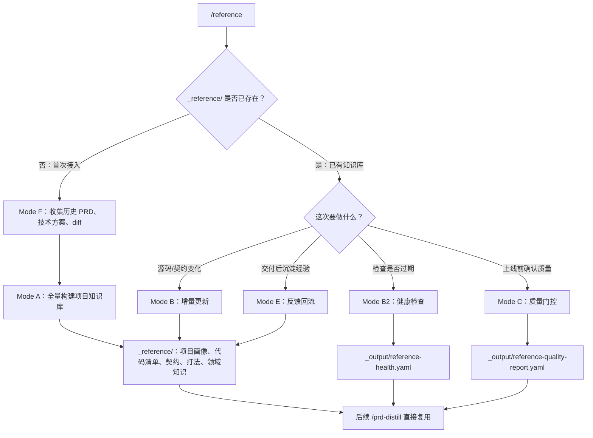

# build-reference

> 构建项目知识库 `_reference/`，把源码结构、业务术语、跨层契约、开发套路沉淀为 PRD-to-code 可复用的长期记忆。

## 快速使用

在 Claude Code 中进入目标项目，运行：

```
/reference
```

首次使用会自动引导：收集历史 PRD → 全量构建。之后每次跑增量更新、健康检查或反馈回流即可。

## 流程总览



## 什么时候用

| 场景 | 用什么 |
|------|--------|
| 团队第一次接入 PRD Tools | Mode F → Mode A |
| 项目结构、接口或业务规则大改 | Mode B 或 Mode A |
| PRD 交付后想沉淀经验 | Mode E |
| 怀疑知识库过期或有幻觉 | Mode B2 → Mode C |
| 上线前做质量确认 | Mode C |

**不适合的场景：** 只是解释代码、直接改代码、没有源码也没有上下文。

## 工作模式

| 模式 | 说明 | 输出 |
|------|------|------|
| **F 上下文收集** | 收集历史 PRD、技术方案、分支 diff | `_output/context-enrichment.yaml` |
| **A 全量构建** | 首次或重建整个知识库 | `_reference/` 全部文件 |
| **B 增量更新** | 只更新受 git diff 影响的部分 | 更新后的 `_reference/` |
| **B2 健康检查** | 检查是否过期、缺证据、边界混乱 | `_output/reference-health.yaml` |
| **C 质量门控** | 检查证据、契约闭环、幻觉风险 | `_output/reference-quality-report.yaml` |
| **E 反馈回流** | 从 prd-distill 输出回收新知识 | `_output/feedback-ingest-report.yaml` |

## 产出文件

### 长期知识库 `_reference/`

```
_reference/
├── 00-portal.md                # 人类导航 + 场景阅读指南
├── project-profile.yaml        # 项目画像：技术栈、入口、能力面
├── 01-codebase.yaml            # 代码库清单：目录、枚举、模块、注册点
├── 02-coding-rules.yaml        # 编码规则：规范 + 踩坑经验
├── 03-contracts.yaml           # 跨层契约：endpoint、schema、字段定义
├── 04-routing-playbooks.yaml   # PRD 路由信号 + 场景打法 + QA 矩阵
└── 05-domain.yaml              # 业务领域：术语、背景、隐式规则
```

### 过程报告 `_output/`

```
_output/
├── context-enrichment.yaml         # 历史样例和 golden sample 候选
├── modules-index.yaml              # 项目扫描快照
├── reference-health.yaml           # 健康检查结果
├── reference-quality-report.yaml   # 质量门控结果
├── feedback-ingest-report.yaml     # 反馈回流审计
└── graph/
    ├── graph-sync-report.yaml      # 图谱可用状态（始终生成）
    ├── GRAPH_STATUS.md             # 给人看的图谱状态
    ├── code-graph-evidence.yaml    # GitNexus 证据
    └── business-graph-evidence.yaml # Graphify 证据
```

## 外部工具如何参与

build-reference 可以利用两个外部图谱工具加速构建。**两个都是可选的**——没有它们也能正常工作（回退到源码扫描）。

| 工具 | 维度 | 它做什么 | 没有它会怎样 |
|------|------|---------|-------------|
| **[GitNexus](https://github.com/abhigyanpatwari/GitNexus)** | 代码结构 | AST 解析 → 模块、符号、调用链、API consumer、执行流追踪 | 用 `rg`/glob + Read 手动扫描源码 |
| **[Graphify](https://github.com/safishamsi/graphify)** | 业务语义 | 从代码/文档中提取业务概念聚类、设计原理、隐式关联 | 手工阅读代码和文档推断业务语义 |

GitNexus 提供 `01-codebase` 和 `03-contracts` 的结构证据；Graphify 提供 `02-coding-rules`、`04-routing-playbooks` 和 `05-domain` 的业务语义证据。

安装脚本会自动索引。后续可手动更新：
```bash
# GitNexus：更新代码结构索引（含语义搜索）
gitnexus analyze . --embeddings

# Graphify：更新代码结构（快速，无 LLM）
graphify update .

# Graphify：深度业务语义图谱（需要 LLM Vision API Key）
# 在 Claude Code 中运行 /graphify . --mode deep
```

## 典型落地路径

**首次接入：**
1. 准备 1-3 个历史 PRD、技术方案和对应分支 diff
2. 运行 `/reference` → Mode F（收集上下文）→ Mode A（全量构建）
3. 运行 Mode B2（健康检查）+ Mode C（质量门控）

**日常使用：**
1. 代码或契约变化后运行 Mode B（增量更新）
2. PRD 交付完成后运行 Mode E（反馈回流）
3. 定期运行 Mode B2 检查知识库是否过期

## 常见问题

**Q: `_reference/` 要提交到 git 吗？**
A: 建议 `.gitignore` 排除。`_reference/` 是本地生成的知识库，每个开发者自己维护。`_output/` 同理。

**Q: 支持哪些项目类型？**
A: 前端、BFF、后端都支持。通过能力面适配器自动识别项目层级和结构，不绑定固定目录。

**Q: 图谱工具都不可用怎么办？**
A: 完全可以工作。build-reference 会回退到源码扫描（rg/glob + Read），只是构建速度慢一些，不会缺少核心能力。

**Q: 多仓项目怎么办？**
A: 每个仓独立维护自己的 `_reference/`。跨仓契约标记为 `needs_confirmation`，等对方 owner 确认后再升级。
