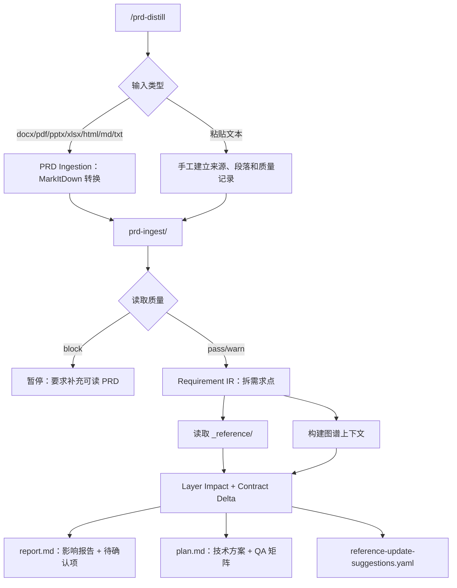

# prd-distill

> 把 PRD 蒸馏成有证据支撑的技术报告和开发计划：影响分析、契约差异、QA 矩阵、待确认问题，全部可追溯到源码和 PRD 原文。

## 快速使用

在 Claude Code 中进入目标项目，运行：

```
/prd-distill <PRD 文件路径或需求文本>
```

示例：

```
/prd-distill docs/新司机完单奖励PRD.docx
/prd-distill 需要在活动页面新增一种优惠券类型，type_id=45
```

## 流程总览



## 什么时候用

| 场景 | 用它 |
|------|------|
| 拿到新 PRD，需要评估影响范围 | 是 |
| 需要给前端/BFF/后端拆任务、对齐接口 | 是 |
| 需要识别字段、枚举、schema 的契约风险 | 是 |
| 需要生成 QA 测试矩阵 | 是 |
| 直接改代码，不需要分析 | 否 |
| 没有任何可分析的输入 | 否 |

## 支持的输入格式

| 格式 | 处理方式 | 注意事项 |
|------|---------|---------|
| `.docx` | MarkItDown 提取正文、表格、图片 | 复杂合并表格可能触发质量警告 |
| `.pdf` | MarkItDown + OCR | 扫描件需 `markitdown-ocr` 包 |
| `.pptx` / `.xlsx` | MarkItDown 转换 | 复杂动画/公式可能丢失细节 |
| `.html` / `.epub` | MarkItDown 转换 | 样式依赖内容可能丢失 |
| `.md` / `.txt` | 保留原文行号 | 图片引用需要 vision 或人工确认 |
| 粘贴文本 | 手工建立来源定位 | 置信度按输入质量标注 |

**图片/流程图处理：** 配置 `ANTHROPIC_AUTH_TOKEN` 或 `OPENAI_API_KEY` 后，自动用 LLM Vision 分析 PRD 中的流程图、设计稿和截图。未配置时标记为"待确认"，不会产生高置信度结论。

## 产出文件

```
_output/prd-distill/<slug>/
├── prd-ingest/                    # PRD 原始读取结果
│   ├── source-manifest.yaml       #   原始文件信息
│   ├── document.md                #   转换后的可读 markdown
│   ├── evidence-map.yaml          #   PRD 块级证据映射
│   ├── media/                     #   抽出的图片
│   ├── tables/                    #   抽出的表格
│   └── extraction-quality.yaml    #   读取质量门禁
├── report.md                      # 影响报告 + 风险 + 待确认项
├── plan.md                        # 技术方案 + 开发计划 + QA 矩阵
└── artifacts/
    ├── evidence.yaml              # 证据台账
    ├── requirement-ir.yaml        # 结构化需求
    ├── layer-impact.yaml          # 分层影响
    ├── contract-delta.yaml        # 契约差异
    └── reference-update-suggestions.yaml  # 知识回流建议
```

**人类阅读：** `report.md`（决策报告）+ `plan.md`（开发计划）

**机器/审计：** `artifacts/` 和 `prd-ingest/` 用于审计复盘和知识回流

## 外部工具如何参与

| 工具 | 它在 prd-distill 中做什么 | 没有 它会怎样 |
|------|-------------------------|-------------|
| **[MarkItDown](https://github.com/microsoft/markitdown)** | 把 docx/pdf/pptx 等转成 markdown | 只能处理 `.md`/`.txt` 和粘贴文本 |
| **[GitNexus](https://github.com/abhigyanpatwari/GitNexus)** | 按 PRD 概念查代码符号、调用链、API consumer | 手动 Read 源码 + grep 搜索 |
| **[Graphify](https://github.com/safishamsi/graphify)** | 查业务概念关联、设计原理、隐式约束 | 手工阅读代码和文档推断 |

MarkItDown 是 PRD 读取的核心依赖；GitNexus 和 Graphify 是可选增强，缺失时 prd-distill 仍可完整运行。

## 典型使用流程

**首次蒸馏：**
1. 确保项目已运行过 `/reference`（有 `_reference/`）
2. 运行 `/prd-distill <PRD 文件>`
3. 先看 `report.md` 的结论和阻塞项
4. 再看 `plan.md` 的开发计划

**日常循环：**
1. `/prd-distill` 分析 PRD → 产出 report + plan
2. 按 plan 开发
3. 交付后运行 `/reference` 的 Mode E 回流经验

## 常见问题

**Q: PRD 是飞书/钉钉链接怎么办？**
A: 目前不支持直接读取在线文档。请导出为 docx/pdf 或复制粘贴文本。

**Q: 报告质量不好怎么办？**
A: 优先确保 `_reference/` 质量过关（先跑 `/reference` 的 B2 健康检查）。reference 越准确，蒸馏质量越高。

**Q: 需要哪些环境变量？**
A: 基础功能不需要。配置 `ANTHROPIC_AUTH_TOKEN` 或 `OPENAI_API_KEY` 后可以分析 PRD 中的图片/流程图。

**Q: `_reference/` 不存在能跑吗？**
A: 能跑，但会缺少项目上下文，影响分析深度。建议先跑 `/reference`。
