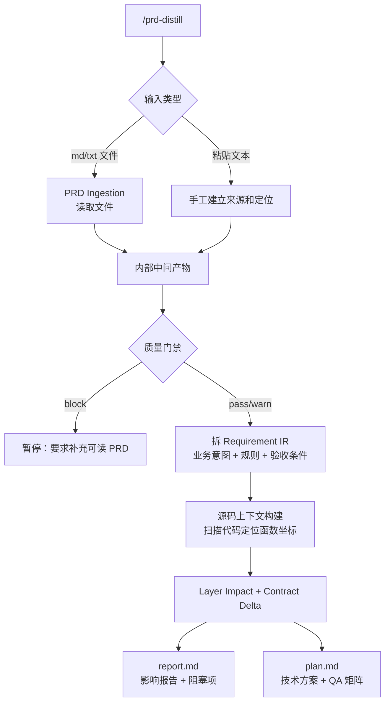

# prd-distill

> 把 PRD 蒸馏成有证据支撑的技术报告和开发计划：影响分析、契约差异、QA 矩阵、待确认问题，全部可追溯到源码和 PRD 原文。

## 快速使用

在 Claude Code 中进入目标项目，运行：

```
/prd-distill <PRD 文件路径或需求文本>
```

**输入格式：** `.md` / `.txt` / `.docx` 文件，或直接粘贴需求文本。`.docx` 用原生 `unzip` 提取文本和图片，Claude 直接看图理解 UI 截图和流程图，零外部依赖。

```
/prd-distill docs/新司机完单奖励PRD.md
/prd-distill 需要在活动页面新增一种优惠券类型，type_id=45
```

如果项目已有 `_prd-tools/reference/`（通过 `/reference` 命令生成），蒸馏质量会更高，但这不是必需的。

## 产出

运行后所有文件写入 `_prd-tools/distill/<slug>/`，产出三样东西：

- **report.md** — 影响报告，含风险项、待确认问题、阻塞项，供人阅读做决策
- **plan.md** — 函数级技术方案 + 开发计划 + QA 测试矩阵，精确到 `file:line`
- **context/** — 结构化中间产物（需求 IR、证据台账、分层影响、契约差异、知识回流建议等），供审计和下游工具消费

### context/ 文件清单

```
context/
├── requirement-ir.yaml              # 结构化需求（业务意图 + 规则 + 验收条件）
├── evidence.yaml                    # 证据台账（每个结论追溯到 PRD 原文）
├── readiness-report.yaml            # 就绪度评分 + 风险
├── graph-context.md                 # 源码扫描的函数级上下文
├── layer-impact.yaml                # 按能力面分层的影响分析
├── contract-delta.yaml              # 字段级契约差异
└── reference-update-suggestions.yaml # 知识回流建议
```

## 流程总览



## 什么时候用

| 场景 | 用它 |
|------|------|
| 拿到新 PRD，需要评估影响范围 | 是 |
| 需要给前端/BFF/后端拆任务、对齐接口 | 是 |
| 需要识别字段、枚举、schema 的契约风险 | 是 |
| 需要生成 QA 测试矩阵 | 是 |
| 直接改代码，不需要分析 | 否 |
| 没有任何可分析的输入 | 否 |

## 典型工作流

1. **蒸馏** — 运行 `/prd-distill <PRD 文件>`，产出 report + plan + context
2. **决策** — 先看 `report.md` 的结论和阻塞项
3. **执行** — 按 `plan.md` 的函数级方案开发，交付后可运行 `/reference` 回流经验
